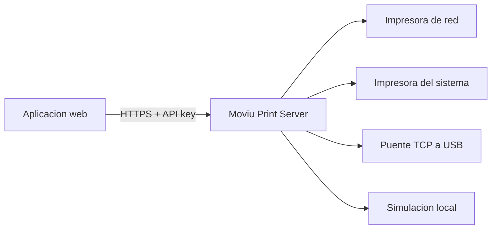

# Moviu Print Server

> Impresion local para aplicaciones web, sin convertir la configuracion en otro proyecto.

[](https://github.com/dancoLgh/moviu/releases/latest)
[](https://dancolgh.github.io/moviu/)
[](https://www.python.org/)
[](LICENSE)
[](#100-vibe-coding)

Moviu Print Server conecta aplicaciones web con impresoras locales o de red mediante una API HTTPS sencilla. Recibe HTML, imagenes, PDF, ESC/POS o ZPL y los dirige a impresoras termicas, impresoras del sistema o equipos de etiquetas.

[Conocer Moviu](https://dancolgh.github.io/moviu/) · [Descargar](https://github.com/dancoLgh/moviu/releases/latest) · [Integrar la API](docs/API_INTEGRACION.md) · [Ver cambios](CHANGELOG.md)

## Por que existe

Moviu nacio de una necesidad concreta: imprimir desde una aplicacion web no deberia exigir una instalacion pesada ni una configuracion de certificados dificil de repetir y mantener.

Frente a alternativas como QZ Tray o JSPrintManager, Moviu propone una ruta enfocada para proyectos que buscan algo directo: instalar una aplicacion, elegir una impresora, iniciar el servicio y consumir una API local. No intenta reemplazar todas las capacidades de esas plataformas; prioriza una experiencia pequena, comprensible y facil de operar.

## Que ofrece

- Aplicacion de escritorio para configurar y supervisar el servidor.
- API REST local protegida mediante `X-API-Key`.
- HTTPS con generacion, exportacion e instalacion guiada de una CA local.
- Impresoras de red por TCP e impresoras instaladas en Windows.
- Puente TCP a USB integrado para impresoras locales.
- Descubrimiento mDNS/DNS-SD mediante Bonjour o Avahi.
- Modo de simulacion con vistas previas para desarrollar sin gastar papel.
- Actualizaciones desde GitHub Releases y soporte para repositorios privados.

## Descarga rapida

| Plataforma | Descarga | Notas |
|---|---|---|
| Windows x86-64 | [Descargar `.exe`](https://github.com/dancoLgh/moviu/releases/latest/download/MoviuPrintServer-Windows-x86_64.exe) | Experiencia principal; incluye impresoras del sistema y puente USB |
| Linux x86-64 | [Descargar binario](https://github.com/dancoLgh/moviu/releases/latest/download/MoviuPrintServer-Linux-x86_64) | Interfaz grafica, impresion de red y simulacion |
| Codigo fuente | [Ver releases](https://github.com/dancoLgh/moviu/releases) | Archivos `.zip` y `.tar.gz` generados por GitHub |

Consulta la [guia de instalacion](docs/INSTALLATION.md) para el primer inicio, certificados, ejecucion desde codigo y empaquetado.

## Tres pasos

1. Instala Moviu y configura tu impresora local o de red.
2. Inicia el servidor y copia la URL HTTPS y la API key.
3. Envia el trabajo desde tu aplicacion.

```bash
curl -k -X POST "https://127.0.0.1:9000/api/print" \
  -H "X-API-Key: $MOVIU_API_KEY" \
  -H "Content-Type: application/json" \
  -d '{
    "mode": "html",
    "content": "<h1>Pedido #1042</h1><p>Listo para retirar</p>",
    "printer": {"host": "192.168.1.50", "port": 9100}
  }'
```

En desarrollo puedes agregar `"simulate": true` para generar una vista previa sin enviar el trabajo a una impresora fisica.

## Modos de impresion

| Modo | Uso principal | Destino |
|---|---|---|
| `html` | Tickets y comprobantes desde HTML | Termica ESC/POS |
| `image` | Logos, codigos y composiciones graficas | Termica ESC/POS |
| `pdf` | Documentos y hojas de cualquier tamano | Local o red |
| `raw` | Bytes ESC/POS en hexadecimal o Base64 | Termica |
| `raw_text` | Texto con escapes y code page seleccionable | Termica |
| `hybrid` | Imagen de cabecera seguida de comandos | Termica |
| `zpl` | Etiquetas Zebra | Impresora ZPL |

La referencia completa de payloads, respuestas, tamanos de papel y errores esta en [Integracion de la API](docs/API_INTEGRACION.md).

## Arquitectura



Moviu se ejecuta en la misma red que las impresoras. La aplicacion web envia trabajos a la API local y Moviu se ocupa de renderizar, adaptar y enrutar el contenido.

## Seguridad y certificados

- Cada instalacion genera una API key local que puede regenerarse.
- La comunicacion usa HTTPS con una CA creada por Moviu.
- La interfaz permite exportar esa CA para instalarla en los dispositivos cliente.
- El portal publico usa HTTP en `http://<ip-local>:<puerto-HTTPS + 1>/certificado`. Por ejemplo, con la API en `https://192.168.1.20:9000`, la guia queda en `http://192.168.1.20:9001/certificado`.
- El listener HTTP solo expone la guia y la descarga de la CA; la API de impresion permanece exclusivamente en HTTPS.
- Los certificados y la configuracion permanecen en `~/.moviu_printer/`.
- El servicio esta pensado para redes locales confiables, no para exposicion directa a Internet.

Moviu no elimina el modelo de confianza de HTTPS; simplifica su generacion y administracion para que la puesta en marcha sea repetible.

El boton **Abrir portal de instalacion** muestra primero la huella SHA-256 local para poder compararla con la pagina. El boton **Habilitar acceso en la red local** abre en el firewall el puerto HTTPS, el puerto HTTP de certificados y, si esta activo, el puerto del puente TCP a USB. En Windows las reglas usan `LocalSubnet`; en Linux usan las subredes IPv4 conectadas mediante UFW o firewalld. El puerto de una impresora remota no se abre porque esa conexion es saliente.

## 100% vibe coding

Moviu fue creado completamente mediante **vibe coding**. El proyecto comenzo con un problema real y evoluciono a traves de iteraciones asistidas por inteligencia artificial, pruebas practicas y ajustes sobre impresoras y flujos concretos.

Esto forma parte de la identidad del proyecto: demostrar que una necesidad operativa puede convertirse en una herramienta abierta y util combinando criterio humano, experimentacion y asistencia de IA. El codigo, sus decisiones y sus limitaciones permanecen visibles para que cualquiera pueda revisarlos y mejorarlos.

## Desarrollo local

```bash
git clone https://github.com/dancoLgh/moviu.git
cd moviu
python3 -m venv .venv
source .venv/bin/activate
pip install -r requirements.txt
python main.py
```

Para ejecutar las pruebas:

```bash
pip install -r requirements-dev.txt
python -m unittest discover -s tests
```

## Publicar una version

Las releases se generan automaticamente al subir una etiqueta `v*`. Antes de crearla, actualiza `VERSION` en `moviu_server/config.py` y confirma que coincida con la etiqueta:

```bash
git tag v1.3.0
git push origin v1.3.0
```

GitHub Actions ejecuta las pruebas, compila Windows y Linux, genera las notas de la release y publica ambos binarios. Si alguna prueba o compilacion falla, la release no se crea.

## Documentacion

- [Instalacion y distribucion](docs/INSTALLATION.md)
- [Integracion completa de la API](docs/API_INTEGRACION.md)
- [Descubrimiento mDNS/DNS-SD](docs/DISCOVERY.md)
- [Puente TCP a USB](tcp_usb_bridge/README.md)
- [Historial de cambios](CHANGELOG.md)
- [Releases publicados](https://github.com/dancoLgh/moviu/releases)

## Licencia

Distribuido bajo la [licencia MIT](LICENSE).
